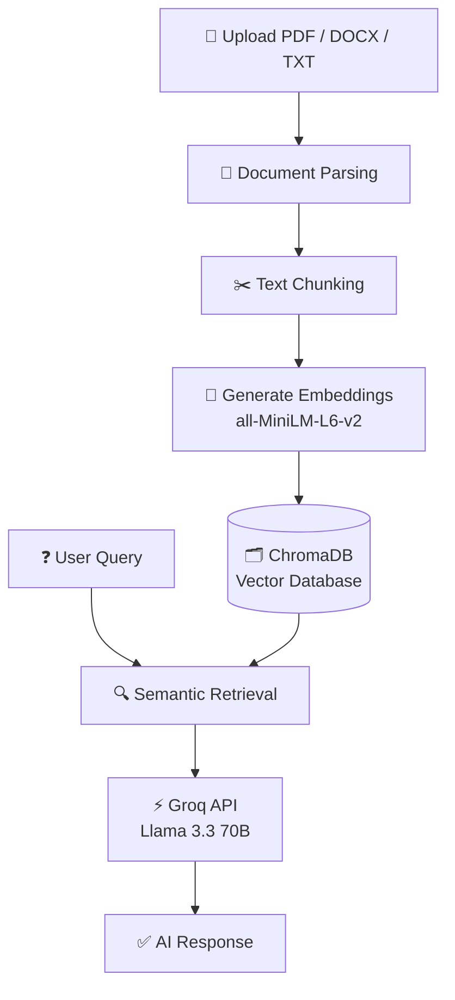

# 🎓 AI Study Companion v2

<div align="center">

### Transform Study Material into an AI-Powered Learning Experience

**RAG • LLMs • Semantic Search • Vector Databases • Personalized Learning**


</div>

---
## 🚀 Live Demo

🌐 **Frontend (App):**  
https://study-companion-ai.streamlit.app

⚙️ **Backend API:**  
https://study-companion-tmgn.onrender.com

---
## 🚀 Overview

**AI Study Companion v2** is a Generative AI-powered educational platform that transforms static study material into an interactive learning ecosystem.

Upload **PDF, DOCX, or TXT files** and instantly generate:

- 💬 Tutor Chat
- 🃏 Flashcards
- 📝 Quiz Mode
- 🗺️ Mind Maps
- 🔍 Topic Analysis
- 📋 Mock Exams
- 📊 Session Summary

Built using **RAG (Retrieval-Augmented Generation)** for grounded, document-aware responses.

---

## ✨ Features

| Feature | Description |
|----------|-------------|
| 💬 Tutor Chat | Context-aware Q&A using RAG |
| 🃏 Flashcards | AI-generated revision cards |
| 📝 Quiz Mode | MCQs with grading & explanations |
| 🗺️ Mind Maps | Interactive concept visualization |
| 🔍 Topic Analysis | Topic & keyword extraction |
| 📋 Mock Exams | Essay/short-answer generation + grading |
| 📊 Session Summary | Weak area identification |

---

## 🧠 Core AI Concepts

### Retrieval-Augmented Generation (RAG)

```text
User Query
    ↓
Retrieve Relevant Chunks
    ↓
LLM Uses Retrieved Context
    ↓
Grounded Answer
```

### Semantic Search

Semantic search understands meaning instead of exact words.

```text
"Machine Learning"
≈
"Artificial Intelligence Learning"
```

### Text Chunking

Large documents are split into smaller chunks for:
- Better retrieval
- Faster search
- Improved context handling

### Chunk Overlap

Prevents context loss between pages.

```text
Chunk 1:
Deep Learning is widely used in

Chunk 2:
widely used in Computer Vision
```

### Embeddings

Text is converted into vectors using:

```text
sentence-transformers/all-MiniLM-L6-v2
```

---

## 🏗️ System Architecture



## ⚙️ Tech Stack

**Backend**
- FastAPI
- Python
- ChromaDB
- Sentence Transformers
- Groq API

**Frontend**
- Streamlit
- Custom CSS
- Multi-page Architecture

---

## 📂 Project Structure

```text
AI-Study-Companion/
│
├── backend/
├── frontend/
│   ├── pages/
│   ├── api_client.py
│   └── app.py
│
├── chroma_db/
├── requirements.txt
├── .env.example
└── README.md
```

---

## 🚀 Getting Started

### 1. Clone Repository

```bash
git clone https://github.com/yourusername/AI-Study-Companion.git
cd AI-Study-Companion
```

### 2. Install Dependencies

```bash
pip install -r requirements.txt
```

### 3. Configure Environment Variables

Create `.env`

```env
GROQ_API_KEY=gsk_your_api_key_here
```

### 4. Run Backend

```bash
uvicorn backend.main:app --reload --port 8000
```

### 5. Run Frontend

```bash
streamlit run frontend/app.py
```

Frontend: `http://localhost:8501`

---

## 🎯 Use Cases

- Exam Preparation
- Lecture Revision
- Personalized Tutoring
- Practice Tests

---

---

## 👨‍💻 Author

**Ashutosh Kshitij Mishra**  | [GitHub](https://github.com/ashutoshm2004) | [LinkedIn](https://linkedin.com/in/ashutoshm04)


AI • Machine Learning • GenAI • Full Stack Development

